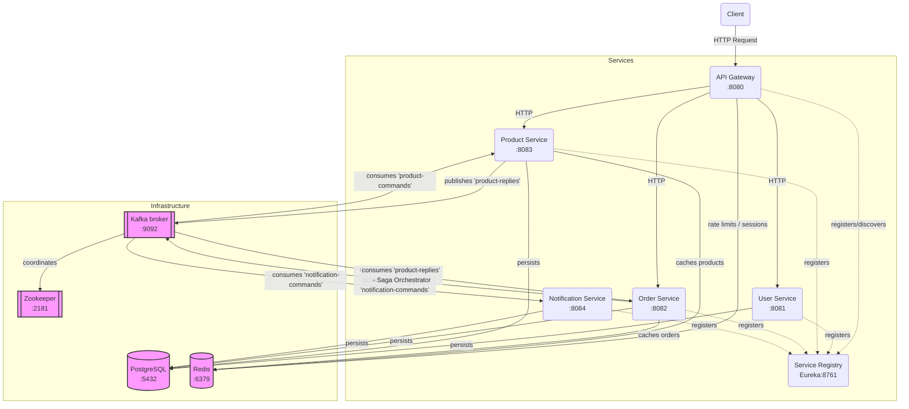

# microservices-demo

Java 21 / Spring Boot 3.3 / Spring Cloud microservices workspace, converted from the
uploaded HTML guide into a real, buildable Eclipse (Maven multi-module) project.

## Modules

| Module | Port | Purpose |
|---|---|---|
| `service-registry` | 8761 | Eureka service registry |
| `api-gateway` | 8080 | Spring Cloud Gateway — routing, JWT check, rate limiting, circuit breaker |
| `user-service` | 8081 | User CRUD (Postgres) |
| `product-service` | 8083 | Product catalog CRUD + Redis caching, handles 'product-commands' (Postgres + Redis + Kafka) |
| `order-service` | 8082 | Order CRUD, Redis cache, Saga Orchestrator, Transactional Outbox (Postgres + Redis + Kafka) |
| `notification-service` | 8084 | Consumes 'notification-commands' from Kafka, stores/serves notifications (Postgres + Kafka) |

## Architecture (Saga Orchestration + Transactional Outbox)



## Database configuration (as requested)

All four data-owning services (`user-service`, `product-service`, `order-service`,
`notification-service`) are pre-configured to use a **single shared PostgreSQL
database** for this demo:

```
Host:     localhost
Port:     5432
Database: micro
Username: postgres
Password: postgres
```

This lives in each module's `src/main/resources/application.yml`, e.g.:

```yaml
spring:
  datasource:
    url: jdbc:postgresql://${DB_HOST:localhost}:${DB_PORT:5432}/${DB_NAME:micro}
    username: ${DB_USER:postgres}
    password: ${DB_PASS:postgres}
```

Every value has an environment-variable override (`DB_HOST`, `DB_PORT`, `DB_NAME`,
`DB_USER`, `DB_PASS`), so you can point at a different host/db in staging or prod
without touching code. `spring.jpa.hibernate.ddl-auto` is set to `update`, so tables
(`users`, `products`, `orders`, `notifications`) are created automatically in the
`micro` database the first time each service starts — you don't need to run any
migration scripts by hand for local dev.

> Note: the original guide split data across `users_db` / `orders_db` / `products_db`
> (one schema per service, the standard microservices pattern). Per your request this
> has been consolidated so every service points at one `micro` database instead —
> just create an empty `micro` database in Postgres and Hibernate does the rest.

Create the database once, if it doesn't already exist:

```bash
psql -U postgres -h localhost -p 5432 -c "CREATE DATABASE micro;"
```

## Importing into Eclipse

1. Make sure you have the **Eclipse IDE for Enterprise Java and Web Developers**
   (bundles m2e, the Maven integration) and a **JDK 21** configured
   (`Window ▸ Preferences ▸ Java ▸ Installed JREs`).
2. `File ▸ Import… ▸ Maven ▸ Existing Maven Projects`.
3. Browse to the extracted `microservices-demo` folder (the one containing the root
   `pom.xml`) and select it — Eclipse will detect the parent POM and all 6 child
   modules.
4. Click **Finish**. Eclipse/m2e will download dependencies and build the reactor.
5. Lombok: this project uses Lombok (`@Data`, `@Builder`, etc.). If Eclipse doesn't
   already have the Lombok plugin installed, download `lombok.jar` from
   https://projectlombok.org/download, run `java -jar lombok.jar`, point it at your
   Eclipse install, and restart Eclipse.
6. Right-click the root project ▸ **Maven ▸ Update Project…** if anything looks red.

## Running locally

You need Postgres, Redis, and Kafka running (see `docker-compose.yml` for a
ready-made stack), then start the services **in this order** — either by
right-clicking each module's `*Application.java` in Eclipse and choosing
**Run As ▸ Java Application**, or from the command line at the repo root:

```bash
# 1. Infra only (Postgres on 5432/db "micro", Redis, Kafka)
docker compose up -d postgres redis kafka zookeeper

# 2. Service registry
cd service-registry && mvn spring-boot:run

# 3. Business services (any order, each registers with Eureka)
cd user-service && mvn spring-boot:run
cd product-service && mvn spring-boot:run
cd order-service && mvn spring-boot:run
cd notification-service && mvn spring-boot:run

# 4. Gateway last (routes to whatever's registered)
cd api-gateway && mvn spring-boot:run
```

Eureka dashboard: http://localhost:8761
All external traffic should go through the gateway: http://localhost:8080/api/...

### Running everything in Docker instead

```bash
mvn clean package -DskipTests   # build all 6 jars once
docker compose up --build
```

## Quick API tests

```bash
# Product (public GET route, no JWT needed)
curl -X POST http://localhost:8083/api/products \
  -H "Content-Type: application/json" \
  -d '{"name":"Keyboard","description":"Mechanical","price":49.99,"stockQuantity":100}'

curl http://localhost:8083/api/products

# User
curl -X POST http://localhost:8081/api/users \
  -H "Content-Type: application/json" \
  -d '{"email":"jane@example.com","fullName":"Jane Doe","password":"secret123"}'

# Order (direct to order-service; via the gateway this route needs a Bearer JWT)
curl -X POST http://localhost:8082/api/orders \
  -H "Content-Type: application/json" \
  -d '{"userId":"user-123","productId":"prod-456","qty":2}'

# Health
curl http://localhost:8082/actuator/health
```

## What's included vs. what's illustrative in the source guide

The uploaded guide fully specified the **order-service** (entity, repository,
service, controller, Redis cache-through, Kafka producer, Testcontainers
integration test) plus the **API gateway** (routes, JWT filter, rate limiter,
circuit breaker) and **service registry** — those are carried over close to
verbatim, corrected to compile (e.g. the gateway's `JwtAuthFilter` is implemented
as a proper `AbstractGatewayFilterFactory` bean, since that's what Spring Cloud
Gateway actually requires to reference a filter by name in YAML).

`user-service`, `product-service`, and `notification-service` were only sketched
as folder trees and partial snippets in the guide (e.g. `ProductService`'s
`@Cacheable` methods, no full entity/controller). Full, working implementations
were written for this project following the same conventions as `order-service`
(records for requests, `ApiResponse<T>` envelope, `GlobalExceptionHandler`, Lombok,
constructor injection).

The original guide used a simple Event Choreography (`order-events`), but this project has been upgraded to a full **Saga Orchestrator** pattern with the **Transactional Outbox** pattern. 
`order-service` implements an `OutboxPoller` to reliably publish `ReserveInventoryCommand`s to `product-commands`, and `ProductService` replies to `product-replies` with success/failure, which `OrderSagaOrchestrator` uses to confirm or cancel the order. Finally, it sends a `SendNotificationCommand` to `notification-service`. This ensures strong distributed transaction guarantees across the services.

Not included (deployment/CI concerns, not application code): the GitHub Actions
pipeline, the AWS ALB Ingress manifest, and the `k8s/` directory tree beyond the
single `order-service` deployment shown in the guide. Say the word if you want
those added too.

## Deployment / CI extras (`.github/`, `k8s/`, `scripts/`)

These are now included too:

- **`.github/workflows/deploy.yml`** — the guide's GitHub Actions pipeline
  (build, ECR login, build+push images, `kubectl set image` on EKS), extended
  to loop over all 6 modules instead of the guide's 4.
- **`k8s/namespaces/namespace.yaml`**, **`k8s/configmaps/app-config.yaml`** —
  declarative forms of the guide's `kubectl create namespace` /
  `kubectl create configmap` commands, with `db.host`/`db.name`/`eureka.url`
  added to the ConfigMap so every service (not just order-service) has what
  it needs.
- **`k8s/secrets/`** — the guide's tree lists an *encrypted* `db-secret.yaml.enc`
  (Bitnami sealed-secrets output). Producing a real `.enc` file requires your
  cluster's sealed-secrets certificate, which isn't available here, so these
  are the plain source `Secret` manifests instead (`db-secret.yaml`,
  `jwt-secret.yaml`) with `kubeseal` instructions in a comment — **don't commit
  these with real credentials**.
- **`k8s/deployments/`** — `order-service.yaml` is the guide's Deployment +
  Service + HPA verbatim (env vars now sourced from the ConfigMap/Secret above
  instead of being separate). `api-gateway.yaml`, `user-service.yaml`, and
  `product-service.yaml` follow the same pattern and were written for this
  project — the guide's tree named these files but didn't show their content.
  `service-registry.yaml` and `notification-service.yaml` are additions
  *beyond* the guide's tree (which only listed 4 of the 6 modules under
  `deployments/`) — without them the stack isn't actually deployable, since
  every other service depends on the registry and the order flow depends on
  notification-service consuming Kafka.
- **`k8s/ingress/ingress.yaml`** — the guide's AWS ALB Ingress, verbatim.
- **`scripts/`** — `init-dbs.sh`, `build-push-all.sh`, `deploy-all.sh` were
  named in the guide's tree with one-line comments but no content; each is
  assembled here from the corresponding CLI commands shown elsewhere in the
  guide (AWS Setup section, kubectl command list). `init-dbs.sh` creates the
  single shared `micro` database rather than three per-service databases,
  consistent with this project's consolidated DB setup.

All of the above use placeholder values (AWS account `123456789...`, region
`ap-south-1`, host `api.myapp.com`) exactly as the guide did — swap in your
own before applying anything to a real cluster.
